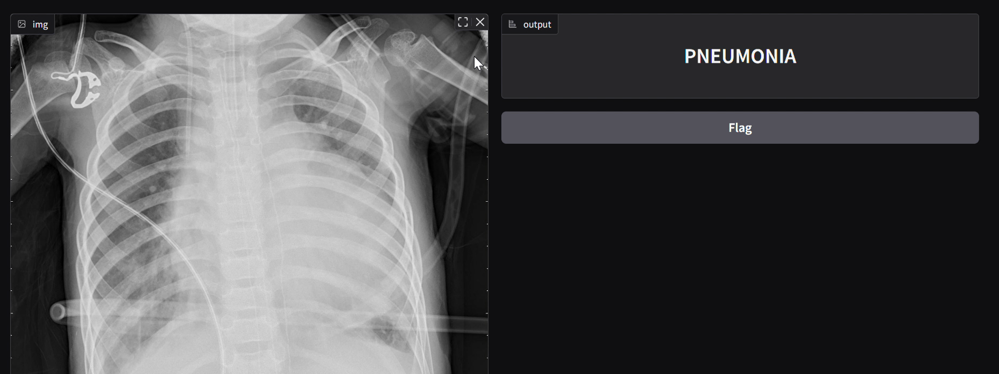

# Hybrid CNN-Transformer Model for Pneumonia Detection

This project implements a hybrid deep learning model to automate pneumonia detection from chest X-ray images. The model combines Convolutional Neural Networks (CNNs) and Vision Transformers (ViTs) to achieve accurate and efficient classification of X-rays into 'Normal' or 'Pneumonia' categories. 

---

## Table of Contents
1.  [Project Overview](#project-overview)
2.  [Background](#background)
3.  [Methodology](#methodology)
4.  [Implementation Details](#implementation-details)
5.  [Setup and Usage](#setup-and-usage)
6.  [Results](#results)
7.  [Future Work](#future-work)
8.  [Dependencies](#dependencies)
9.  [References](#references)
10. [Authors](#authors)

---

## 1. Project Overview 

This project addresses the critical need for timely and accurate pneumonia diagnosis, especially in resource-limited healthcare settings. It leverages deep learning to analyze chest X-ray images and provide automated diagnostic support. The core of the project is a hybrid model that integrates EfficientNetV2 (a CNN) with a Vision Transformer (ViT), enhanced by attention mechanisms like CBAM and BreastNet blocks. This architecture is designed to capture both local features and global dependencies within the images, leading to improved classification accuracy. 

## 2. Background 

Deep learning has revolutionized medical image analysis, with CNNs and ViTs playing a crucial role. 

* **Convolutional Neural Networks (CNNs):** CNNs, particularly EfficientNetV2, are effective in capturing local patterns and fine-grained details in images, which are essential for identifying pneumonia-related features in X-rays. 
* **Vision Transformers (ViTs):** ViTs excel at learning global relationships and long-range dependencies within images, providing context that CNNs might miss.
* **Hybrid Models:** Combining CNNs and ViTs leverages the strengths of both architectures, leading to more robust and accurate image classification. 
* **Attention Mechanisms:** Modules like CBAM and BreastNet enhance the model's ability to focus on diagnostically relevant regions in the X-ray images. 

## 3. Methodology 

The project's methodology involves the development and implementation of a hybrid CNN-Transformer model for binary classification of chest X-ray images (Normal/Pneumonia).

* **CNN Path:**
    * Backbone: EfficientNetV2
    * Attention: CBAM
    * Multi-Scale Feature Extraction: BreastNet Block
    * Output: Local feature vector (Global Average Pooling) 
* **ViT Path:**
    * Architecture: Vision Transformer
    * Functionality: Global context extraction 
* **Feature Fusion:**
    * Concatenation
    * Dense Layer & Dropout
    * Ensemble Output: Averaged prediction from three softmax heads 

## 4. Implementation Details 

* **Frontend:** Gradio interface for user interaction. 
* **Dataset:** Chest X-ray Pneumonia dataset from Kaggle. 
* **Preprocessing:**
    * Image resizing (224x224)
    * Normalization and grayscale conversion
    * Data augmentation (horizontal flipping, random rotation, zooming, shifting)
    * Data split (70-20-10 for training, validation, testing) 
* **Training Setup:**
    * Loss Function: Categorical Crossentropy
    * Optimizer: Adam
    * Metrics: Accuracy, Precision, Recall, F1-Score, AUC
    * Regularization: Dropout, Batch Normalization
    * Class balancing: Computed class weights

## 5. Setup and Usage 

To use this system:

1.  Open the provided Colab notebook.
2.  Run the cells to execute the code, including data loading, preprocessing, model training, and evaluation.
3.  Utilize the Gradio interface to upload chest X-ray images and obtain predictions.

## 6. Results 

The hybrid model demonstrated high classification performance in differentiating between normal and pneumonia-infected chest X-rays. Specific performance metrics (Accuracy, Precision, Recall, F1-Score, AUC) can be found in the Colab notebook and the project report. 

Click on the image video to view the working of the model in Gradio interface.

## 7. Future Work 

Future development directions include: 

* Multi-class diagnosis (e.g., COVID-19, Tuberculosis)
* Integration of explainability tools (e.g., Grad-CAM)
* Optimization for mobile/edge deployment
* Federated learning for privacy-preserving training
* Collaboration with medical institutions for real-world validation

## 8. Dependencies 

The project uses the following Python libraries:

* pandas
* scikit-learn
* tensorflow
* Gradio

## 9. References 

* Saha, M., Chakraborty, M., Maiti, S., & Das, D. (2024). Breast-NET: A lightweight DCNN model for breast cancer detection and grading using histological samples. Neural Computing and Applications, 36, 20067–20087. 
* Zhang, T., Zhang, S., Chen, Z., Bengio, Y., & Liu, D. (2024). PMFL: Partial Meta-Federated Learning for heterogeneous tasks and its applications on real-world medical records. arXiv preprint arXiv:2112.05321v2. 
* Yoon, J., Cho, H., Baek, D., Bengio, Y., & Ahn, S. (2025). Monte Carlo Tree Diffusion for System 2 Planning. arXiv preprint arXiv:2502.07202. [cite: 101, 102]

## 10. Authors 
* Devanshi Shrivastava
